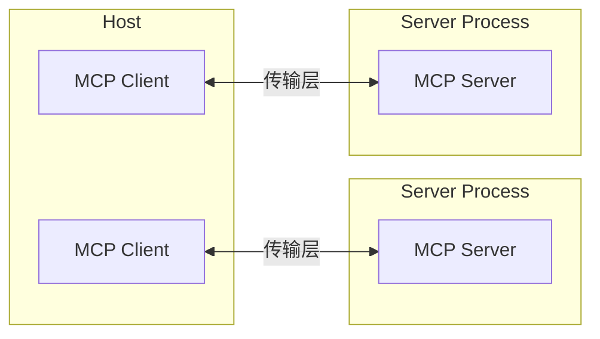
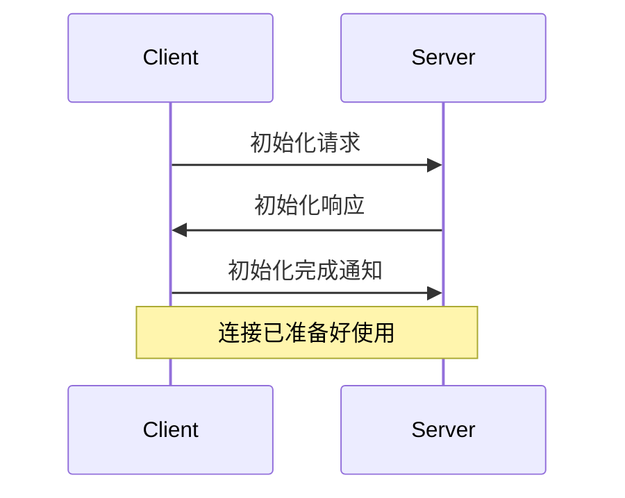

模型上下文协议（Model Context Protocol，简称 MCP）基于灵活且可扩展的架构，能够实现 LLM 应用程序与集成之间的无缝通信。本文件将介绍核心架构组件与概念。

## 概述

MCP 遵循一个客户端-服务器架构，其中：

- **主机** 是启动连接的 LLM 应用程序（如 Claude 桌面版或集成开发环境 IDE）
- **客户端** 在主机应用程序内部与服务器保持 1:1 的连接
- **服务器** 为客户端提供上下文、工具和提示



## 核心组件

### 协议层

协议层处理消息的格式化、请求/响应关联以及高级通信模式。

<Tabs>
  <Tab title="TypeScript">
    ```typescript
    class Protocol<Request, Notification, Result> {
        // 处理传入请求
        setRequestHandler<T>(schema: T, handler: (request: T, extra: RequestHandlerExtra) => Promise<Result>): void

        // 处理传入通知
        setNotificationHandler<T>(schema: T, handler: (notification: T) => Promise<void>): void

        // 发送请求并等待响应
        request<T>(request: Request, schema: T, options?: RequestOptions): Promise<T>

        // 发送单向通知
        notification(notification: Notification): Promise<void>
    }
    ```
  </Tab>
  <Tab title="Python">
    ```python
    class Session(BaseSession[RequestT, NotificationT, ResultT]):
        async def send_request(
            self,
            request: RequestT,
            result_type: type[Result]
        ) -> Result:
            """
            发送请求并等待响应。如果响应包含错误，则抛出 McpError。
            """
            # 请求处理实现

        async def send_notification(
            self,
            notification: NotificationT
        ) -> None:
            """发送单向通知，不期待响应。"""
            # 通知处理实现

        async def _received_request(
            self,
            responder: RequestResponder[ReceiveRequestT, ResultT]
        ) -> None:
            """处理来自另一方的传入请求。"""
            # 请求处理实现

        async def _received_notification(
            self,
            notification: ReceiveNotificationT
        ) -> None:
            """处理来自另一方的传入通知。"""
            # 通知处理实现
    ```
  </Tab>
</Tabs>

关键类包括：

- `Protocol`
- `Client`
- `Server`

### 传输层

传输层处理客户端与服务器之间的实际通信。MCP 支持多种传输机制：

1. **标准输入输出 (Stdio) 传输**
   - 使用标准输入/输出进行通信
   - 适用于本地进程

2. **基于 HTTP 和 SSE 的传输**
   - 使用服务器发送事件（Server-Sent Events，简称 SSE）实现服务器到客户端的消息传递
   - 客户端到服务器的消息通过 HTTP POST 实现

所有传输方式均使用 [JSON-RPC](https://www.jsonrpc.org/) 2.0 协议进行消息交换。关于 Model Context Protocol 消息格式的详细信息，请参阅 [规范](https://spec.modelcontextprotocol.io)。

### 消息类型

MCP 包含以下主要类型的消息：

1. **请求** 期望从另一方获得响应：
    ```typescript
    interface Request {
      method: string;
      params?: { ... };
    }
    ```

2. **结果** 是对请求的成功响应：
    ```typescript
    interface Result {
      [key: string]: unknown;
    }
    ```

以下是文本的中文翻译：

---

### 3. **错误** 表示请求失败：
```typescript
interface Error {
  code: number;
  message: string;
  data?: unknown;
}
```

### 4. **通知** 是不期望响应的单向消息：
```typescript
interface Notification {
  method: string;
  params?: { ... };
}
```

## 连接生命周期

### 1. 初始化



1. 客户端发送包含协议版本和能力的 `initialize` 请求
2. 服务器使用其协议版本和能力进行响应
3. 客户端发送 `initialized` 通知作为确认
4. 开始正常的消息交换

### 2. 消息交换

初始化完成后，支持以下模式：

- **请求-响应**：客户端或服务器发送请求，另一方进行响应
- **通知**：任一方可发送单向消息

### 3. 终止

任一方可以终止连接方式包括：
- 通过调用 `close()` 进行正常关闭
- 传输链接断开
- 错误情况

## 错误处理

MCP 定义了以下标准错误代码：

```typescript
enum ErrorCode {
  // 标准 JSON-RPC 错误代码
  ParseError = -32700,
  InvalidRequest = -32600,
  MethodNotFound = -32601,
  InvalidParams = -32602,
  InternalError = -32603
}
```

SDK 和应用程序可以定义大于 -32000 的自定义错误代码。

错误通过以下方式传播：
- 对请求的错误响应
- 传输上的错误事件
- 协议级别的错误处理程序

## 实现示例

以下是一个实现 MCP 服务器的基本示例：

<Tabs>
  <Tab title="TypeScript">
    ```typescript
    import { Server } from "@modelcontextprotocol/sdk/server/index.js";
    import { StdioServerTransport } from "@modelcontextprotocol/sdk/server/stdio.js";

    const server = new Server({
      name: "example-server",
      version: "1.0.0"
    }, {
      capabilities: {
        resources: {}
      }
    });

    // 处理请求
    server.setRequestHandler(ListResourcesRequestSchema, async () => {
      return {
        resources: [
          {
            uri: "example://resource",
            name: "Example Resource"
          }
        ]
      };
    });

    // 连接传输
    const transport = new StdioServerTransport();
    await server.connect(transport);
    ```
  </Tab>
  <Tab title="Python">
    ```python
    import asyncio
    import mcp.types as types
    from mcp.server import Server
    from mcp.server.stdio import stdio_server

    app = Server("example-server")

    @app.list_resources()
    async def list_resources() -> list[types.Resource]:
        return [
            types.Resource(
                uri="example://resource",
                name="Example Resource"
            )
        ]

    async def main():
        async with stdio_server() as streams:
            await app.run(
                streams[0],
                streams[1],
                app.create_initialization_options()
            )

    if __name__ == "__main__":
        asyncio.run(main)
    ```
  </Tab>
</Tabs>

## 最佳实践

### 传输选择

1. **本地通信**
   - 对于本地进程使用标准输入输出（stdio）传输
   - 对于同一台机器上的通信效率更高
   - 简化进程管理
   
2. **远程通信**
   - 在需要 HTTP 兼容的场景下使用 SSE
   - 需考虑包括认证和授权在内的安全性问题

### 消息处理

1. **请求处理**
   - 彻底验证输入
   - 使用类型安全的模式
   - 优雅处理错误
   - 实现超时机制

2. **进度报告**
   - 对长时间操作使用进度标识
   - 分阶段报告进度
   - 在已知时包含总进度

---

3. **错误管理**
   - 使用合适的错误代码
   - 包含有帮助的错误信息
   - 在出现错误时清理资源

## 安全注意事项

1. **传输安全**
   - 对远程连接使用TLS
   - 验证连接来源
   - 根据需要实现身份认证

2. **消息验证**
   - 验证所有传入消息
   - 清理输入数据
   - 检查消息大小的限制
   - 验证JSON-RPC格式

3. **资源保护**
   - 实现访问控制
   - 验证资源路径
   - 监控资源使用情况
   - 对请求进行速率限制

4. **错误处理**
   - 不泄漏敏感信息
   - 记录与安全相关的错误
   - 实现适当的清理机制
   - 处理DoS（拒绝服务）场景

## 调试和监控

1. **日志记录**
   - 记录协议事件
   - 跟踪消息流
   - 监控性能
   - 记录错误

2. **诊断**
   - 实现健康检查
   - 监控连接状态
   - 跟踪资源使用
   - 分析性能

3. **测试**
   - 测试不同的传输方式
   - 验证错误处理
   - 检查边界情况
   - 对服务器进行负载测试