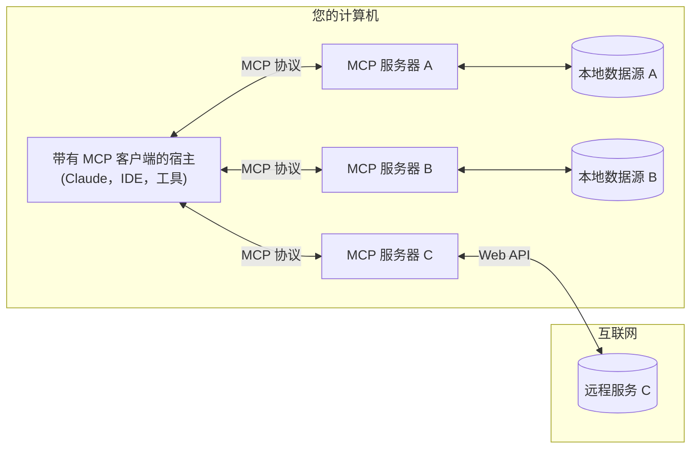

<Note>Java SDK已发布！查看[最新更新内容](/development/updates)</Note>

MCP 是一种开放协议，旨在标准化应用程序向大型语言模型（LLM）提供上下文的方式。可以将 MCP 想象成 AI 应用程序的 USB-C 接口。就像 USB-C 提供了一种统一的方式来将设备连接到各种外设和配件一样，MCP 提供了一种统一的方式来将 AI 模型连接到不同的数据源和工具。

## 为什么选择 MCP？

MCP 可以帮助您在 LLM 之上构建智能代理和复杂工作流。LLM 通常需要与数据和工具集成，而 MCP 提供了以下优势：
- 一系列不断增加的预构建集成，您的 LLM 可以直接使用
- 灵活切换 LLM 提供商和供应商
- 在您的基础架构内确保数据安全的最佳实践

### 总体架构

MCP 的核心是一个客户端-服务器架构，其中宿主应用可以连接到多个服务器：

- **MCP 宿主**：像 Claude Desktop、IDE 或 AI 工具等希望通过 MCP 访问数据的程序
- **MCP 客户端**：与服务器保持一对一连接的协议客户端
- **MCP 服务器**：通过标准化的模型上下文协议公开特定功能的轻量级程序
- **本地数据源**：MCP 服务器可以安全访问的计算机文件、数据库和服务
- **远程服务**：使用网络 API 等方式连接的互联网外部系统

## 入门指南

选择最适合您需求的路径：

#### 快速开始
<CardGroup cols={2}>
  <Card
    title="针对服务器开发者"
    icon="bolt"
    href="/quickstart/server"
  >
    开始构建您自己的服务器，以供 Claude for Desktop 和其他客户端使用
  </Card>
  <Card
    title="针对客户端开发者"
    icon="bolt"
    href="/quickstart/client"
  >
    开始构建您自己的客户端，可与所有 MCP 服务器集成
  </Card>
  <Card
    title="针对 Claude Desktop 用户"
    icon="bolt"
    href="/quickstart/user"
  >
    开始在 Claude for Desktop 中使用预构建的服务器
  </Card>
</CardGroup>

#### 示例
<CardGroup cols={2}>
  <Card
    title="服务器示例"
    icon="grid"
    href="/examples"
  >
    查看我们提供的官方 MCP 服务器和实现案例库
  </Card>
  <Card
    title="客户端示例"
    icon="cubes"
    href="/clients"
  >
    查看支持 MCP 集成的客户端列表
  </Card>
</CardGroup>

## 教程

<CardGroup cols={2}>
  <Card
    title="利用 LLM 构建 MCP"
    icon="comments"
    href="/tutorials/building-mcp-with-llms"
  >
    学习如何使用 LLM（如 Claude）加速 MCP 开发
  </Card>
  <Card
    title="调试指南"
    icon="bug"
    href="/docs/tools/debugging">
    学习如何高效调试 MCP 服务器和集成工具
  </Card>
  <Card
    title="MCP 检测器"
    icon="magnifying-glass"
    href="/docs/tools/inspector"
  >
    使用我们的互动调试工具测试和检查您的 MCP 服务器
  </Card>
  <Card
    title="MCP 工作坊（视频，2小时）"
    icon="person-chalkboard"
    href="https://www.youtube.com/watch?v=kQmXtrmQ5Zg"
  >
    <iframe src="https://www.youtube.com/embed/kQmXtrmQ5Zg"> </iframe>
  </Card>
</CardGroup>

## 探索 MCP

深入了解 MCP 的核心概念和功能：

<CardGroup cols={2}>
  <Card
    title="核心架构"
    icon="sitemap"
    href="/docs/concepts/architecture"
  >
    了解 MCP 如何连接客户端、服务器和大型语言模型（LLM）
  </Card>
  <Card
    title="资源"
    icon="database"
    href="/docs/concepts/resources"
  >
    将服务器中的数据和内容暴露给 LLM
  </Card>
  <Card
    title="提示"
    icon="message"
    href="/docs/concepts/prompts"
  >
    创建可重用的提示模板和工作流
  </Card>
  <Card
    title="工具"
    icon="wrench"
    href="/docs/concepts/tools"
  >
    让 LLM 能通过您的服务器执行操作
  </Card>
  <Card
    title="采样"
    icon="robot"
    href="/docs/concepts/sampling"
  >
    允许您的服务器向 LLM 请求生成完成内容
  </Card>
  <Card
    title="传输机制"
    icon="network-wired"
    href="/docs/concepts/transports"
  >
    了解 MCP 的通信机制
  </Card>
</CardGroup>

## 贡献

想要贡献？请查看我们的[贡献指南](/development/contributing)，了解如何帮助改进 MCP。

## 支持与反馈

以下是获取帮助或提供反馈的方式：

- 如果是关于 MCP 规范、SDK 或文档（开源项目）的错误报告或功能请求，请[创建一个 GitHub issue](https://github.com/modelcontextprotocol)
- 如果是关于 MCP 规范的讨论或问答，请使用[规范讨论区](https://github.com/modelcontextprotocol/specification/discussions)
- 如果是关于其他 MCP 开源组件的讨论或问答，请使用[组织讨论区](https://github.com/orgs/modelcontextprotocol/discussions)
- 如果是关于 Claude.app 和 claude.ai 的 MCP 集成相关的错误报告、功能请求或问题，请发送电子邮件至 mcp-support@anthropic.com