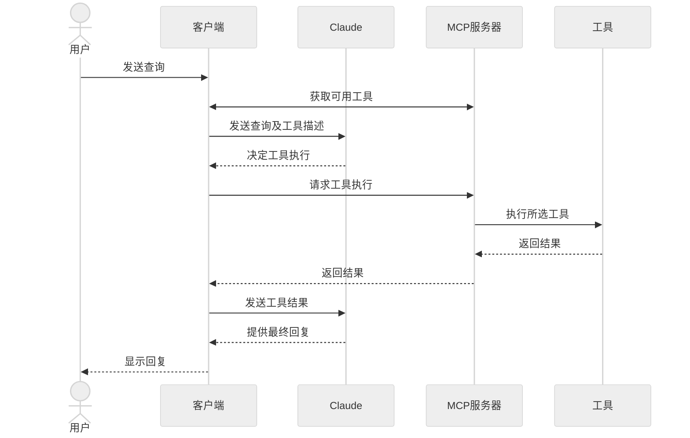

在本教程中，你将学习如何构建一个由 LLM 驱动的聊天机器人客户端，该客户端可以连接到 MCP 服务器。在开始之前，建议先完成 [服务器快速入门](/quickstart/server) 教程，了解如何构建你的第一个服务器的基础知识。

<Tabs>
<Tab title="Python">

[你可以在此处找到本教程的完整代码。](https://github.com/modelcontextprotocol/quickstart-resources/tree/main/mcp-client-python)

## 系统要求

在开始之前，请确保你的系统满足以下要求：
- Mac 或 Windows 计算机
- 已安装最新版本的 Python
- 已安装最新版本的 `uv`

## 设置开发环境

首先，使用 `uv` 创建一个新的 Python 项目：

```bash
# 创建项目目录
uv init mcp-client
cd mcp-client

# 创建虚拟环境
uv venv

# 激活虚拟环境
# 在 Windows 上：
.venv\Scripts\activate
# 在 Unix 或 MacOS 上：
source .venv/bin/activate

# 安装所需包
uv add mcp anthropic python-dotenv

# 删除样板文件
rm hello.py

# 创建主文件
touch client.py
```

## 设置 API 密钥

你需要从 [Anthropic 控制台](https://console.anthropic.com/settings/keys) 获取一个 Anthropic API 密钥。

创建一个 `.env` 文件以存储密钥：

```bash
# 创建 .env 文件
touch .env
```

将密钥添加到 `.env` 文件中：
```bash
ANTHROPIC_API_KEY=<你的密钥>
```

将 `.env` 加入 `.gitignore` 文件里：
```bash
echo ".env" >> .gitignore
```

<Warning>
确保妥善保管你的 `ANTHROPIC_API_KEY`，避免泄露！
</Warning>

## 创建客户端

### 基本客户端结构

首先，设置我们的导入模块并创建基本的客户端类：

```python
import asyncio
from typing import Optional
from contextlib import AsyncExitStack

from mcp import ClientSession, StdioServerParameters
from mcp.client.stdio import stdio_client

from anthropic import Anthropic
from dotenv import load_dotenv

load_dotenv()  # 从 .env 文件中加载环境变量

class MCPClient:
    def __init__(self):
        # 初始化会话和客户端对象
        self.session: Optional[ClientSession] = None
        self.exit_stack = AsyncExitStack()
        self.anthropic = Anthropic()
    # 接下来将定义方法
```

### 服务器连接管理

接下来，我们实现连接到 MCP 服务器的方法：

```python
async def connect_to_server(self, server_script_path: str):
    """连接到 MCP 服务器

    参数:
        server_script_path: 服务器脚本的路径 (.py 或 .js)
    """
    is_python = server_script_path.endswith('.py')
    is_js = server_script_path.endswith('.js')
    if not (is_python or is_js):
        raise ValueError("服务器脚本必须是 .py 或 .js 文件")

    command = "python" if is_python else "node"
    server_params = StdioServerParameters(
        command=command,
        args=[server_script_path],
        env=None
    )

    stdio_transport = await self.exit_stack.enter_async_context(stdio_client(server_params))
    self.stdio, self.write = stdio_transport
    self.session = await self.exit_stack.enter_async_context(ClientSession(self.stdio, self.write))

    await self.session.initialize()

    # 列出可用的工具
    response = await self.session.list_tools()
    tools = response.tools
    print("\n已连接到服务器，以下工具可用：", [tool.name for tool in tools])
```

### 查询处理逻辑

现在为处理查询和处理工具调用添加核心功能：

```python
async def process_query(self, query: str) -> str:
    """使用 Claude 和可用工具处理查询"""
    messages = [
        {
            "role": "user",
            "content": query
        }
    ]

    response = await self.session.list_tools()
    available_tools = [{
        "name": tool.name,
        "description": tool.description,
        "input_schema": tool.inputSchema
    } for tool in response.tools]
```

### 翻译文本如下：

#### 初始 Claude API 调用
```python
# 初始 Claude API 调用
response = self.anthropic.messages.create(
    model="claude-3-5-sonnet-20241022",
    max_tokens=1000,
    messages=messages,
    tools=available_tools
)

# 处理响应并处理工具调用
final_text = []

assistant_message_content = []
for content in response.content:
    if content.type == 'text':
        final_text.append(content.text)
        assistant_message_content.append(content)
    elif content.type == 'tool_use':
        tool_name = content.name
        tool_args = content.input

        # 执行工具调用
        result = await self.session.call_tool(tool_name, tool_args)
        final_text.append(f"[调用工具 {tool_name}，使用参数 {tool_args}]")

        assistant_message_content.append(content)
        messages.append({
            "role": "assistant",
            "content": assistant_message_content
        })
        messages.append({
            "role": "user",
            "content": [
                {
                    "type": "tool_result",
                    "tool_use_id": content.id,
                    "content": result.content
                }
            ]
        })

        # 从 Claude 获取下一步响应
        response = self.anthropic.messages.create(
            model="claude-3-5-sonnet-20241022",
            max_tokens=1000,
            messages=messages,
            tools=available_tools
        )

        final_text.append(response.content[0].text)

return "\n".join(final_text)
```

### 交互式聊天界面
添加交互式聊天循环和清理功能：

```python
async def chat_loop(self):
    """运行交互式聊天循环"""
    print("\nMCP 客户端已启动！")
    print("请输入您的问题或输入 'quit' 退出。")

    while True:
        try:
            query = input("\n问题: ").strip()

            if query.lower() == 'quit':
                break

            response = await self.process_query(query)
            print("\n" + response)

        except Exception as e:
            print(f"\n错误: {str(e)}")

async def cleanup(self):
    """清理资源"""
    await self.exit_stack.aclose()
```

### 主入口

最后，添加主执行逻辑：

```python
async def main():
    if len(sys.argv) < 2:
        print("使用方法: python client.py <服务器脚本路径>")
        sys.exit(1)

    client = MCPClient()
    try:
        await client.connect_to_server(sys.argv[1])
        await client.chat_loop()
    finally:
        await client.cleanup()

if __name__ == "__main__":
    import sys
    asyncio.run(main())
```

完整的 `client.py` 文件可以在[此处](https://gist.github.com/zckly/f3f28ea731e096e53b39b47bf0a2d4b1)找到。

---

## 关键组件解释

### 1. 客户端初始化
- `MCPClient` 类负责初始化会话管理和 API 客户端
- 使用 `AsyncExitStack` 确保资源正确管理
- 配置 Anthropic 客户端以支持 Claude 的交互

### 2. 服务器连接
- 支持 Python 和 Node.js 服务器
- 验证服务器脚本类型
- 设置正确的通信通道
- 初始化会话并列出可用工具

### 3. 查询处理
- 维护对话上下文
- 处理 Claude 的响应和工具调用
- 管理 Claude 与工具之间的消息流
- 将结果整合为连贯的响应

### 4. 交互界面
- 提供一个简单的命令行界面
- 处理用户输入并显示响应
- 包含基础错误处理
- 支持正常退出

### 5. 资源管理
- 确保资源正确清理
- 处理连接问题的错误
- 支持优雅关闭程序

## 常见的定制化点
（此部分省略，保持与原文一致）

以下是翻译成中文的内容：

---

1. **工具处理**
   - 修改 `process_query()` 以处理特定的工具类型
   - 添加工具调用的自定义错误处理
   - 实现工具特定的响应格式化

2. **响应处理**
   - 自定义工具结果的格式化方式
   - 添加响应过滤或转换功能
   - 实现定制化日志记录

3. **用户界面**
   - 添加图形用户界面（GUI）或网页界面
   - 实现丰富的控制台输出
   - 添加命令历史或自动补全功能

## 运行客户端

要使用任意 MCP 服务器运行客户端，请运行以下命令：

```bash
uv run client.py path/to/server.py # Python 服务器
uv run client.py path/to/build/index.js # Node.js 服务器
```

<说明>
如果您正在从服务器快速入门教程继续学习天气服务示例，您的命令可能类似于：`python client.py .../weather/src/weather/server.py`
</说明>

运行客户端时：

1. 连接到指定的服务器
2. 列出可用的工具
3. 开始一个交互式聊天会话，在此您可以：
   - 输入查询
   - 查看工具的执行情况
   - 获取 Claude 的响应结果

以下是连接到服务器快速入门的天气服务后的示例输出：

<框架>
  
</框架>

## 工作原理

当您提交一个查询时：

1. 客户端从服务器获取可用工具的列表
2. 您的查询和工具描述一起发送给 Claude
3. Claude 决定是否使用工具以及使用哪些工具
4. 客户端通过服务器执行所请求的工具调用
5. 结果返回给 Claude
6. Claude 提供一个自然语言响应
7. 响应显示给您

## 最佳实践

1. **错误处理**
   - 始终在 try-catch 块中封装工具调用
   - 提供有意义的错误消息
   - 优雅地处理连接问题

2. **资源管理**
   - 使用 `AsyncExitStack` 实现正确的资源清理
   - 在完成时关闭连接
   - 处理服务器断开连接的情况

3. **安全性**
   - 将 API 密钥安全存储在 `.env` 文件中
   - 验证服务器响应
   - 谨慎处理工具的使用权限

## 故障排除

### 服务器路径问题
- 仔细检查服务器脚本的路径是否正确
- 如果相对路径无效，请使用绝对路径
- 对于 Windows 用户，确保路径中使用正斜杠 (/) 或转义反斜杠 (\\)
- 确保服务器文件具有正确的扩展名（Python 的 .py 或 Node.js 的 .js）

正确路径的用法示例：
```bash
# 相对路径
uv run client.py ./server/weather.py

# 绝对路径
uv run client.py /Users/username/projects/mcp-server/weather.py

# Windows 路径（以下格式都可用）
uv run client.py C:/projects/mcp-server/weather.py
uv run client.py C:\\projects\\mcp-server\\weather.py
```

### 响应时间
- 第一个响应可能需要长达 30 秒返回
- 这是正常现象，通常在以下情况下发生：
  - 服务器初始化
  - Claude 处理查询
  - 工具正在被执行
- 随后的响应通常更快
- 在初始等待期间不要中断进程

### 常见错误信息

如果您看到以下提示：
- `FileNotFoundError`: 检查您的服务器路径是否正确
- `Connection refused`: 确保服务器正在运行且路径正确
- `Tool execution failed`: 确认工具所需的环境变量是否已设置
- `Timeout error`: 考虑增加客户端配置中的超时时间

</标签页>

<标签页 标题="Node">

[您可以在此处找到本教程的完整代码。](https://github.com/modelcontextprotocol/quickstart-resources/tree/main/mcp-client-typescript)
## 系统要求

在开始之前，请确保您的系统满足以下要求：
- Mac 或 Windows 电脑
- 已安装 Node.js 16 或更高版本
- 已安装最新版本的 `npm`
- Anthropic API 密钥（Claude）

## 设置您的环境

首先，创建并设置您的项目：

<代码组>
```bash MacOS/Linux
# 创建项目目录
mkdir mcp-client-typescript
cd mcp-client-typescript

# 初始化 npm 项目
npm init -y
```

将以下文本翻译成中文：

---

### 安装依赖项

使用以下命令安装必要的运行时依赖项：

```bash
npm install @anthropic-ai/sdk @modelcontextprotocol/sdk dotenv
```

安装开发依赖项：

```bash
npm install -D @types/node typescript
```

创建一个源文件：

```bash
touch index.ts
```

---

### 使用 PowerShell (Windows)

以下是针对 Windows 的对应操作：

#### 创建项目目录

```powershell
md mcp-client-typescript
cd mcp-client-typescript
```

#### 初始化 npm 项目

```powershell
npm init -y
```

#### 安装依赖项

```powershell
npm install @anthropic-ai/sdk @modelcontextprotocol/sdk dotenv
```

#### 安装开发依赖项

```powershell
npm install -D @types/node typescript
```

#### 创建源文件

```powershell
new-item index.ts
```

---

### 更新 `package.json` 文件

将 `package.json` 文件中的 `type` 设置为 `"module"` 并添加一个构建脚本：

```json
{
  "type": "module",
  "scripts": {
    "build": "tsc && chmod 755 build/index.js"
  }
}
```

---

### 创建 `tsconfig.json` 配置文件

在项目根目录下创建名为 `tsconfig.json` 的文件并添加以下内容：

```json
{
  "compilerOptions": {
    "target": "ES2022",
    "module": "Node16",
    "moduleResolution": "Node16",
    "outDir": "./build",
    "rootDir": "./",
    "strict": true,
    "esModuleInterop": true,
    "skipLibCheck": true,
    "forceConsistentCasingInFileNames": true
  },
  "include": ["index.ts"],
  "exclude": ["node_modules"]
}
```

---

### 设置 API 密钥

您需要从 [Anthropic 控制台](https://console.anthropic.com/settings/keys) 获取一个 API 密钥。

在项目中创建一个 `.env` 文件来存储此密钥：

```bash
echo "ANTHROPIC_API_KEY=<your key here>" > .env
```

将 `.env` 文件添加到 `.gitignore` 以防止泄漏：

```bash
echo ".env" >> .gitignore
```

**注意：务必确保您的 `ANTHROPIC_API_KEY` 密钥安全！**

---

### 创建客户端

#### 基本客户端结构

首先，在 `index.ts` 文件中设置导入并创建基础客户端类：

```typescript
import { Anthropic } from "@anthropic-ai/sdk";
import {
  MessageParam,
  Tool,
} from "@anthropic-ai/sdk/resources/messages/messages.mjs";
import { Client } from "@modelcontextprotocol/sdk/client/index.js";
import { StdioClientTransport } from "@modelcontextprotocol/sdk/client/stdio.js";
import readline from "readline/promises";
import dotenv from "dotenv";

dotenv.config();

const ANTHROPIC_API_KEY = process.env.ANTHROPIC_API_KEY;
if (!ANTHROPIC_API_KEY) {
  throw new Error("ANTHROPIC_API_KEY is not set");
}

class MCPClient {
  private mcp: Client;
  private anthropic: Anthropic;
  private transport: StdioClientTransport | null = null;
  private tools: Tool[] = [];

  constructor() {
    this.anthropic = new Anthropic({
      apiKey: ANTHROPIC_API_KEY,
    });
    this.mcp = new Client({ name: "mcp-client-cli", version: "1.0.0" });
  }
  // 方法将在这里编写
}
```

---

#### 管理服务器连接

接下来，我们实现一个方法，用于连接 MCP 服务器：

```typescript
async connectToServer(serverScriptPath: string) {
  try {
    const isJs = serverScriptPath.endsWith(".js");
    const isPy = serverScriptPath.endsWith(".py");
    if (!isJs && !isPy) {
      throw new Error("服务器脚本必须是 .js 或 .py 文件");
    }
    const command = isPy
      ? process.platform === "win32"
        ? "python"
        : "python3"
      : process.execPath;
    
    this.transport = new StdioClientTransport({
      command,
      args: [serverScriptPath],
    });
    this.mcp.connect(this.transport);
    
    const toolsResult = await this.mcp.listTools();
    this.tools = toolsResult.tools.map((tool) => {
      return {
        name: tool.name,
        description: tool.description,
        input_schema: tool.inputSchema,
      };
    });
    console.log(
      "已连接到服务器，包含以下工具：",
      this.tools.map(({ name }) => name)
    );
  } catch (e) {
    console.log("连接 MCP 服务器失败：", e);
    throw e;
  }
}
```

---

#### 查询处理逻辑

最后，添加用于处理查询和工具调用的核心功能：

```typescript
async processQuery(query: string) {
  const messages: MessageParam[] = [
    {
      role: "user",
      content: query,
    },
  ];
```

--- 

希望这些步骤对您有帮助！如果需要进一步协助，请告诉我。

### 将原文翻译为中文

以下是提供的代码片段以及相关内容的中文翻译：

---

### 核心代码部分

```typescript
const response = await this.anthropic.messages.create({
  model: "claude-3-5-sonnet-20241022",
  max_tokens: 1000,
  messages,
  tools: this.tools,
});

const finalText = [];
const toolResults = [];

for (const content of response.content) {
  if (content.type === "text") {
    finalText.push(content.text);
  } else if (content.type === "tool_use") {
    const toolName = content.name;
    const toolArgs = content.input as { [x: string]: unknown } | undefined;

    const result = await this.mcp.callTool({
      name: toolName,
      arguments: toolArgs,
    });
    toolResults.push(result);
    finalText.push(
      `[使用工具 ${toolName}，参数为 ${JSON.stringify(toolArgs)}]`
    );

    messages.push({
      role: "user",
      content: result.content as string,
    });

    const response = await this.anthropic.messages.create({
      model: "claude-3-5-sonnet-20241022",
      max_tokens: 1000,
      messages,
    });

    finalText.push(
      response.content[0].type === "text" ? response.content[0].text : ""
    );
  }
}

return finalText.join("\n");
```

#### 中文说明：

1. **功能：**  
   代码段代表一个系统与 Claude 模型的交互逻辑。具体来说，系统会发送指定的消息到模型，处理返回的响应，并根据需要调用外部工具。

2. **翻译：**
   - `finalText`：最终的文本结果列表。
   - `toolResults`：存储由工具返回的结果列表。
   - `messages.push`：将工具调用的结果作为下一步对话传回 Claude 模型。
   - `[使用工具 ${toolName}，参数为 ${JSON.stringify(toolArgs)}]`：表明工具被调用，并展示其名称和参数。

---

### 交互式聊天接口

```typescript
async chatLoop() {
  const rl = readline.createInterface({
    input: process.stdin,
    output: process.stdout,
  });

  try {
    console.log("\nMCP 客户端已启动！");
    console.log("输入您的问题，或输入 'quit' 退出。");

    while (true) {
      const message = await rl.question("\n查询内容: ");
      if (message.toLowerCase() === "quit") {
        break;
      }
      const response = await this.processQuery(message);
      console.log("\n" + response);
    }
  } finally {
    rl.close();
  }
}

async cleanup() {
  await this.mcp.close();
}
```

#### 中文说明：

1. **功能：**  
   代码实现了一个交互式命令行聊天工具，允许用户输入查询并接收 Claude 模型的响应。

2. **翻译：**
   - `"MCP 客户端已启动！"`：通知用户客户端已启动。
   - `"输入您的问题，或输入 'quit' 退出。"`：指示用户可以通过输入 "quit" 来退出交互。
   - `"\n查询内容: "`：提示用户输入问题。
   - `this.processQuery(message)`：处理用户输入的查询并获得响应。

---

### 主程序入口点

```typescript
async function main() {
  if (process.argv.length < 3) {
    console.log("用法: node index.ts <服务器脚本路径>");
    return;
  }
  const mcpClient = new MCPClient();
  try {
    await mcpClient.connectToServer(process.argv[2]);
    await mcpClient.chatLoop();
  } finally {
    await mcpClient.cleanup();
    process.exit(0);
  }
}

main();
```

#### 中文说明：

1. **功能：**  
   定义了程序的主入口，用于启动客户端，并连接到指定的服务器。

2. **翻译：**
   - `"用法: node index.ts <服务器脚本路径>"`：提示正确的命令行用法。
   - `await mcpClient.connectToServer(process.argv[2])`：连接到服务器脚本。
   - `await mcpClient.chatLoop()`：启动交互式聊天循环。
   - `mcpClient.cleanup()`：在程序退出前清理资源。

---

### 如何运行客户端

运行您的客户端，以连接到任意 MCP 服务器：

```bash
# 构建 TypeScript 文件
npm run build

# 运行客户端
node build/index.js path/to/server.py # Python 服务器
node build/index.js path/to/build/index.js # Node.js 服务器
```

#### 中文说明：

1. **步骤：**  
   - 使用 `npm run build` 构建 TypeScript 项目。
   - 通过 `node build/index.js` 执行客户端程序，并提供服务器脚本路径。

2. **<提示>：**  
   如果您继续的是“天气服务教程”的服务器快速入门，您的命令可能如下所示：
   ```
   node build/index.js .../quickstart-resources/weather-server-typescript/build/index.js
   ```

---

### 客户端如何工作

提交查询后，客户端的执行流程如下：
1. 客户端从服务器获取可用工具列表。
2. 用户的查询被发送到 Claude，并附上工具描述信息。
3. Claude 决定是否调用工具，并给出相应的指令。
4. 客户端调用服务器提供的工具接口并获取结果。
5. 结果被回传给 Claude，供进一步分析。
6. Claude 返回最终的自然语言响应。
7. 响应内容显示在用户界面中。

---

### 最佳实践

1. **错误处理：**  
   - 使用 TypeScript 的类型系统改善错误检测能力。  
   - 用 `try-catch` 块封装工具调用逻辑。
   - 提供有意义的错误信息。  
   - 优雅地处理连接问题。

2. **安全性：**
   - 将 API 密钥安全地存储在 `.env` 文件中。  
   - 验证服务器响应的有效性。  
   - 谨慎处理工具的使用权限。

---

### 故障排除

如果遇到问题，请检查以下内容：  
1. 服务器脚本路径是否正确。  
2. Claude 模型是否已正确配置。  
3. 客户端和服务器的通信接口是否匹配。  
4. 网络连接是否稳定。


### 服务器路径问题
- 仔细检查服务器脚本的路径是否正确。
- 如果相对路径不起作用，请使用绝对路径。
- Windows用户请确保在路径中使用正斜杠（/）或者转义的反斜杠（\\）。
- 确认服务器文件具有正确的扩展名（Node.js需要.js，Python需要.py）。

正确路径使用示例：
```bash
# 相对路径
node build/index.js ./server/build/index.js

# 绝对路径
node build/index.js /Users/username/projects/mcp-server/build/index.js

# Windows路径（两种格式均适用）
node build/index.js C:/projects/mcp-server/build/index.js
node build/index.js C:\\projects\\mcp-server\\build\\index.js
```

### 响应时间
- 首次响应可能需要最多30秒返回。
- 这种情况是正常的，并且发生在以下过程中：
  - 服务器初始化
  - Claude处理查询
  - 工具运行
- 后续响应通常会更快。
- 请不要在初次等待期间中断该过程。

### 常见错误信息

如果出现以下错误：
- `Error: Cannot find module`：检查编译的构建文件夹，确保TypeScript编译成功。
- `Connection refused`：确认服务器正在运行且路径正确。
- `Tool execution failed`：验证工具的必要环境变量是否已设置。
- `ANTHROPIC_API_KEY is not set`：检查您的.env文件和环境变量。
- `TypeError`：确保工具参数使用了正确的类型。

</标签>

<标签 标题="Java">

<提示>
这是一个基于Spring AI MCP自动配置和启动器的快速入门演示。
如果您想了解如何手动创建同步和异步MCP客户端，请参阅[Java SDK 客户端](/sdk/java/mcp-client)文档。
</提示>

此示例演示如何构建一个交互式聊天机器人，该聊天机器人结合了Spring AI的模型上下文协议（MCP）与[Brave搜索MCP服务器](https://github.com/modelcontextprotocol/servers/tree/main/src/brave-search)。该应用程序创建了一个由Anthropic的Claude AI模型支持的对话界面，该界面可以通过Brave搜索执行互联网搜索，实现基于自然语言的实时网页数据交互。
[完整代码可以在此处找到。](https://github.com/spring-projects/spring-ai-examples/tree/main/model-context-protocol/web-search/brave-chatbot)

## 系统要求

在开始之前，请确保您的系统满足以下要求：
- Java 17或更高版本
- Maven 3.6+
- npx包管理器
- Anthropic API密钥（Claude）
- Brave搜索API密钥

## 设置您的环境

1. 安装npx（Node Package eXecute）：
   首先，确保安装了[npm](https://docs.npmjs.com/downloading-and-installing-node-js-and-npm)，然后运行以下命令：
   ```bash
   npm install -g npx
   ```

2. 克隆代码库：
   ```bash
   git clone https://github.com/spring-projects/spring-ai-examples.git
   cd model-context-protocol/brave-chatbot
   ```

3. 设置您的API密钥：
   ```bash
   export ANTHROPIC_API_KEY='your-anthropic-api-key-here'
   export BRAVE_API_KEY='your-brave-api-key-here'
   ```

4. 构建应用程序：
   ```bash
   ./mvnw clean install
   ```

5. 使用Maven运行应用程序：
   ```bash
   ./mvnw spring-boot:run
   ```

<警告>
请确保妥善保管您的`ANTHROPIC_API_KEY`和`BRAVE_API_KEY`密钥！
</警告>

## 工作原理

该应用程序通过以下组件将Spring AI与Brave搜索MCP服务器集成：

### MCP客户端配置

1. 在pom.xml文件中添加所需依赖项：
```xml
<dependency>
    <groupId>org.springframework.ai</groupId>
    <artifactId>spring-ai-mcp-client-spring-boot-starter</artifactId>
</dependency>
<dependency>
    <groupId>org.springframework.ai</groupId>
    <artifactId>spring-ai-anthropic-spring-boot-starter</artifactId>
</dependency>
```

### 翻译成中文

#### 2. 应用属性 (application.yml 文件):
```yml
spring:
  ai:
    mcp:
      client:
        enabled: true
        name: brave-search-client
        version: 1.0.0
        type: SYNC
        request-timeout: 20s
        stdio:
          root-change-notification: true
          servers-configuration: classpath:/mcp-servers-config.json
    anthropic:
      api-key: ${ANTHROPIC_API_KEY}
```

以上配置启用了 `spring-ai-mcp-client-spring-boot-starter`，它会根据提供的服务器配置创建一个或多个 `McpClient` 实例。

#### 3. MCP 服务器配置 (`mcp-servers-config.json` 文件):
```json
{
  "mcpServers": {
    "brave-search": {
      "command": "npx",
      "args": [
        "-y",
        "@modelcontextprotocol/server-brave-search"
      ],
      "env": {
        "BRAVE_API_KEY": "<填入您的 BRAVE API 密钥>"
      }
    }
  }
}
```

### 聊天实现

该聊天机器人通过 Spring AI 的 ChatClient 并集成 MCP 工具来实现：

```java
var chatClient = chatClientBuilder
    .defaultSystem("你是一个非常有用的助手，擅长人工智能和 Java。")
    .defaultTools((Object[]) mcpToolAdapter.toolCallbacks())
    .defaultAdvisors(new MessageChatMemoryAdvisor(new InMemoryChatMemory()))
    .build();
```

关键功能：
- 使用 Claude AI 模型处理自然语言理解
- 通过 MCP 集成 Brave 搜索，实现实时网络搜索能力
- 使用 InMemoryChatMemory 维护对话上下文
- 以交互式命令行应用程序形式运行

### 构建和运行

运行以下命令进行构建和启动：

```bash
./mvnw clean install
java -jar ./target/ai-mcp-brave-chatbot-0.0.1-SNAPSHOT.jar
```

或

```bash
./mvnw spring-boot:run
```

应用启动后将开启一个交互式聊天会话，您可以提问。聊天机器人会在需要时通过 Brave 搜索从互联网获取信息以回答您的问题。

聊天机器人功能：
- 使用内置知识回答问题
- 需要时通过 Brave 搜索进行网络查询
- 在对话中记住之前消息的上下文
- 综合多个信息来源以提供全面答案

### 高级配置

MCP 客户端支持以下的高级配置选项：

- 通过 `McpSyncClientCustomizer` 或 `McpAsyncClientCustomizer` 客户端定制化
- 支持多客户端以及多种传输类型：`STDIO` 和 `SSE`（服务器发送事件）
- 集成 Spring AI 工具执行框架
- 自动化客户端初始化及生命周期管理

对于基于 WebFlux 的应用，可以使用 WebFlux 的组件启动器：

```xml
<dependency>
    <groupId>org.springframework.ai</groupId>
    <artifactId>spring-ai-mcp-client-webflux-spring-boot-starter</artifactId>
</dependency>
```

此配置提供了类似功能，但使用基于 WebFlux 的 SSE 传输实现，推荐用于生产环境部署。

#### Kotlin 部分

[您可以在此处找到本教程的完整代码。](https://github.com/modelcontextprotocol/kotlin-sdk/tree/main/samples/kotlin-mcp-client)

### 系统要求

在开始之前，请确保您的系统满足以下要求：
- Java 17 或更高版本
- Anthropic API 密钥 (Claude)

### 设置运行环境

首先，如果您尚未安装 `java` 和 `gradle`，请先安装。  
您可以从 [Oracle JDK 官网](https://www.oracle.com/java/technologies/downloads/) 下载 `java`。

验证您的 `java` 安装：
```bash
java --version
```

现在开始创建和设置您的项目：

#### 创建项目代码组

```bash MacOS/Linux
# 为项目创建一个新目录
mkdir kotlin-mcp-client
cd kotlin-mcp-client

# 初始化一个新的 Kotlin 项目
gradle init
```

```powershell Windows
# 为项目创建一个新目录
md kotlin-mcp-client
cd kotlin-mcp-client
# 初始化一个新的 Kotlin 项目
gradle init
```

运行 `gradle init` 后，您将看到创建项目的选项。请选择 **Application** 作为项目类型，**Kotlin** 作为编程语言，以及 **Java 17** 作为 Java 版本。

或者，您也可以使用 [IntelliJ IDEA 项目向导](https://kotlinlang.org/docs/jvm-get-started.html) 来创建一个 Kotlin 应用。

创建项目后，添加以下依赖项：

<CodeGroup>
```kotlin build.gradle.kts
val mcpVersion = "0.3.0"
val slf4jVersion = "2.0.9"
val anthropicVersion = "0.8.0"

dependencies {
    implementation("io.modelcontextprotocol:kotlin-sdk:$mcpVersion")
    implementation("org.slf4j:slf4j-nop:$slf4jVersion")
    implementation("com.anthropic:anthropic-java:$anthropicVersion")
}
```

```groovy build.gradle
def mcpVersion = '0.3.0'
def slf4jVersion = '2.0.9'
def anthropicVersion = '0.8.0'
dependencies {
    implementation "io.modelcontextprotocol:kotlin-sdk:$mcpVersion"
    implementation "org.slf4j:slf4j-nop:$slf4jVersion"
    implementation "com.anthropic:anthropic-java:$anthropicVersion"
}
```
</CodeGroup>

同时，将以下插件添加到您的构建脚本中：
<CodeGroup>
```kotlin build.gradle.kts
plugins {
    id("com.github.johnrengelman.shadow") version "8.1.1"
}
```

```groovy build.gradle
plugins {
    id 'com.github.johnrengelman.shadow' version '8.1.1'
}
```
</CodeGroup>

## 设置您的 API 密钥

您需要从 [Anthropic 控制台](https://console.anthropic.com/settings/keys) 获取一枚 Anthropic API 密钥。

设置您的 API 密钥：
```bash
export ANTHROPIC_API_KEY='your-anthropic-api-key-here'
```

<Warning>
请确保将 `ANTHROPIC_API_KEY` 保密！
</Warning>

## 创建客户端

### 基础客户端结构

首先，让我们创建基础的客户端类：

```kotlin
class MCPClient : AutoCloseable {
    private val anthropic = AnthropicOkHttpClient.fromEnv()
    private val mcp: Client = Client(clientInfo = Implementation(name = "mcp-client-cli", version = "1.0.0"))
    private lateinit var tools: List<ToolUnion>

    // 方法将在此处添加

    override fun close() {
        runBlocking {
            mcp.close()
            anthropic.close()
        }
    }
```

### 服务器连接管理

接下来，我们实现一个连接 MCP 服务器的方法：

```kotlin
suspend fun connectToServer(serverScriptPath: String) {
    try {
        val command = buildList {
            when (serverScriptPath.substringAfterLast(".")) {
                "js" -> add("node")
                "py" -> add(if (System.getProperty("os.name").lowercase().contains("win")) "python" else "python3")
                "jar" -> addAll(listOf("java", "-jar"))
                else -> throw IllegalArgumentException("服务器脚本必须是 .js、.py 或 .jar 文件")
            }
            add(serverScriptPath)
        }

        val process = ProcessBuilder(command).start()
        val transport = StdioClientTransport(
            input = process.inputStream.asSource().buffered(),
            output = process.outputStream.asSink().buffered()
        )

        mcp.connect(transport)
```

以下是将您提供的代码翻译成中文后的内容：

---

### 工具结果与工具列表逻辑
```kotlin
val toolsResult = mcp.listTools()
tools = toolsResult?.tools?.map { tool ->
    ToolUnion.ofTool(
        Tool.builder()
            .name(tool.name)  // 工具名称
            .description(tool.description ?: "")  // 工具描述，默认为空字符串
            .inputSchema(
                Tool.InputSchema.builder()
                    .type(JsonValue.from(tool.inputSchema.type))  // 输入模式的类型
                    .properties(tool.inputSchema.properties.toJsonValue())  // 输入模式的属性
                    .putAdditionalProperty("required", JsonValue.from(tool.inputSchema.required))  // 是否必需
                    .build()
            )
            .build()
    )
} ?: emptyList()  // 如果未能获取到工具列表，则返回空列表

println("已连接到服务器，工具列表: ${tools.joinToString(", ") { it.tool().get().name() }}")
} catch (e: Exception) {
    println("连接 MCP 服务器失败: $e")  // 打印错误信息
    throw e  // 抛出异常
}
```

---

### 转换 JsonObject 为 JsonValue 的辅助函数

添加一个辅助函数，用于将 `JsonObject` 转为适用于 Anthropic 的 `JsonValue`。

```kotlin
private fun JsonObject.toJsonValue(): JsonValue {
    val mapper = ObjectMapper()  // 创建 ObjectMapper 实例
    val node = mapper.readTree(this.toString())  // 将 JsonObject 转成树形节点
    return JsonValue.fromJsonNode(node)  // 创建 JsonValue
}
```

---

### 查询处理逻辑
实现处理查询和处理工具调用的主要逻辑：

```kotlin
private val messageParamsBuilder: MessageCreateParams.Builder = MessageCreateParams.builder()
    .model(Model.CLAUDE_3_5_SONNET_20241022)  // 指定模型
    .maxTokens(1024)  // 设置最大 token 数量

suspend fun processQuery(query: String): String {
    val messages = mutableListOf(
        MessageParam.builder()
            .role(MessageParam.Role.USER)  // 消息角色为用户
            .content(query)  // 用户输入内容
            .build()
    )

    val response = anthropic.messages().create(
        messageParamsBuilder
            .messages(messages)  // 向模型发送用户消息
            .tools(tools)  // 添加工具支持
            .build()
    )

    val finalText = mutableListOf<String>()  // 保存最终的响应文本
    response.content().forEach { content ->
        when {
            content.isText() -> finalText.add(content.text().getOrNull()?.text() ?: "")
            // 如果响应是文本，添加到结果列表

            content.isToolUse() -> {
                val toolName = content.toolUse().get().name()  // 获取工具名称
                val toolArgs =
                    content.toolUse().get()._input().convert(object : TypeReference<Map<String, JsonValue>>() {})
                // 获取工具调用的输入参数

                val result = mcp.callTool(
                    name = toolName,  // 调用的工具名称
                    arguments = toolArgs ?: emptyMap()  // 工具调用参数
                )
                finalText.add("[调用工具 $toolName，参数: $toolArgs]")  // 记录工具调用信息

                messages.add(
                    MessageParam.builder()
                        .role(MessageParam.Role.USER)
                        .content(
                            """
                                "type": "tool_result",
                                "tool_name": $toolName,
                                "result": ${result?.content?.joinToString("\n") { (it as TextContent).text ?: "" }}
                            """.trimIndent()
                        )
                        .build()
                )
                // 添加工具调用结果作为新的用户消息

                val aiResponse = anthropic.messages().create(
                    messageParamsBuilder
                        .messages(messages)  // 继续与模型交互
                        .build()
                )

                finalText.add(aiResponse.content().first().text().getOrNull()?.text() ?: "")
                // 获取模型的进一步响应内容
            }
        }
    }

    return finalText.joinToString("\n", prefix = "", postfix = "")  // 将响应文本拼接成最终文本
}
```

---

### 交互式聊天

添加聊天循环逻辑：

```kotlin
suspend fun chatLoop() {
    println("\nMCP 客户端已启动！")
    println("请输入您的问题或输入 'quit' 退出程序。")

    while (true) {
        print("\n您的问题: ")
        val message = readLine() ?: break  // 读取用户输入
        if (message.lowercase() == "quit") break  // 如果输入 'quit'，退出循环
        val response = processQuery(message)  // 调用处理查询的逻辑
        println("\n$response")  // 打印模型响应
    }
}
```

---

### 主程序入口

最后，添加主入口函数：

```kotlin
fun main() {
    runBlocking {
        try {
            chatLoop()  // 启动聊天循环
        } catch (e: Exception) {
            println("程序运行时发生错误: $e")  // 打印错误信息
        }
    }
}
```

---

通过上述代码，程序实现了一个支持工具调用的交互式聊天系统，并且可以通过提供的 MCP (工具管理器) 完成查询逻辑的处理以及工具相关功能的辅助调用。

下面是文本的中文翻译：

```kotlin
fun main(args: Array<String>) = runBlocking {
    if (args.isEmpty()) throw IllegalArgumentException("使用方式: java -jar <你的路径>/build/libs/kotlin-mcp-client-0.1.0-all.jar <服务器脚本路径>")
    val serverPath = args.first()
    val client = MCPClient()
    client.use {
        client.connectToServer(serverPath)
        client.chatLoop()
    }
}
```

## 运行客户端

可以通过以下方式运行客户端以连接任意 MCP 服务器：

```bash
./gradlew build

# 运行客户端
java -jar build/libs/<你的 Jar 文件名>.jar path/to/server.jar # JVM服务器
java -jar build/libs/<你的 Jar 文件名>.jar path/to/server.py # Python服务器
java -jar build/libs/<你的 Jar 文件名>.jar path/to/build/index.js # Node服务器
```

<提示>
如果你正在继续从服务器 Quickstart 教程中的天气教程，那么你的命令可能类似于：`java -jar build/libs/kotlin-mcp-client-0.1.0-all.jar .../samples/weather-stdio-server/build/libs/weather-stdio-server-0.1.0-all.jar`
</提示>

**客户端功能包括：**
1. 连接到指定的服务器
2. 列出可用工具
3. 启动交互式聊天会话，你可以：
   - 输入查询
   - 查看工具执行过程
   - 获取来自 Claude 的回复

## 工作原理

以下是高层次的工作流程示意图：



当你提交查询时：
1. 客户端从服务器获取可用工具列表
2. 查询连同工具描述一起发送给 Claude
3. Claude 决定是否使用工具及使用哪些工具
4. 客户端通过服务器执行任何请求的工具调用
5. 将工具结果返回给 Claude
6. Claude 提供自然语言回复
7. 回复显示给用户

## 最佳实践

1. **错误处理**
   - 利用 Kotlin 的类型系统显式建模错误
   - 在可能抛出异常时对外部工具和 API 调用使用 `try-catch` 块
   - 提供清晰而有意义的错误信息
   - 优雅地处理网络超时和连接问题

2. **安全性**
   - 安全存储 API 密钥和密钥，例如放置在 `local.properties`、环境变量或保密管理器中
   - 验证所有外部响应以避免意外或不安全的数据使用
   - 在使用工具时，要注意权限和信任边界

## 故障排除

### 服务器路径问题
- 仔细检查你的服务器脚本路径是否正确
- 如果相对路径不起作用，请使用绝对路径
- 如果是 Windows 用户，请确保使用正斜杠（/）或转义反斜杠（\\）
- 确保所需的运行环境已安装（Java用于 JVM，npm用于 Node.js，uv用于 Python）
- 确认服务器文件具有正确的扩展名（Java服务器使用 .jar，Node.js 使用 .js，Python 使用 .py）

正确路径示例：
```bash
# 相对路径
java -jar build/libs/client.jar ./server/build/libs/server.jar

# 绝对路径
java -jar build/libs/client.jar /Users/username/projects/mcp-server/build/libs/server.jar

# Windows路径（两种格式均可）
java -jar build/libs/client.jar C:/projects/mcp-server/build/libs/server.jar
java -jar build/libs/client.jar C:\\projects\\mcp-server\\build\\libs\\server.jar
```

### 响应时间
- 第一个响应可能需要长达 30 秒返回
- 这是正常的，可能是由于以下原因：
  - 服务器初始化
  - Claude 处理查询
  - 工具正在执行
- 后续响应通常会更快
- 在此初始等待期间，请不要中断进程

### 常见错误信息

如果看到以下信息：
- `Connection refused`: 请确保服务器正在运行并且路径正确
- `Tool execution failed`: 请检查工具所需的环境变量是否已正确设置
- `ANTHROPIC_API_KEY is not set`: 请检查您的环境变量

</Tab>

</Tabs>

## 下一步

<CardGroup cols={2}>
  <Card
    title="示例服务器"
    icon="grid"
    href="/examples"
  >
    查看我们官方 MCP 服务器和实现的示例库
  </Card>
  <Card
    title="客户端"
    icon="cubes"
    href="/clients"
  >
    查看支持 MCP 集成的客户端列表
  </Card>
  <Card
    title="使用 LLM 构建 MCP"
    icon="comments"
    href="/tutorials/building-mcp-with-llms"
  >
    学习如何使用类似 Claude 的 LLM 来加速 MCP 的开发
  </Card>
   <Card
    title="核心架构"
    icon="sitemap"
    href="/docs/concepts/architecture"
  >
    了解 MCP 如何连接客户端、服务器和 LLM
  </Card>
</CardGroup>